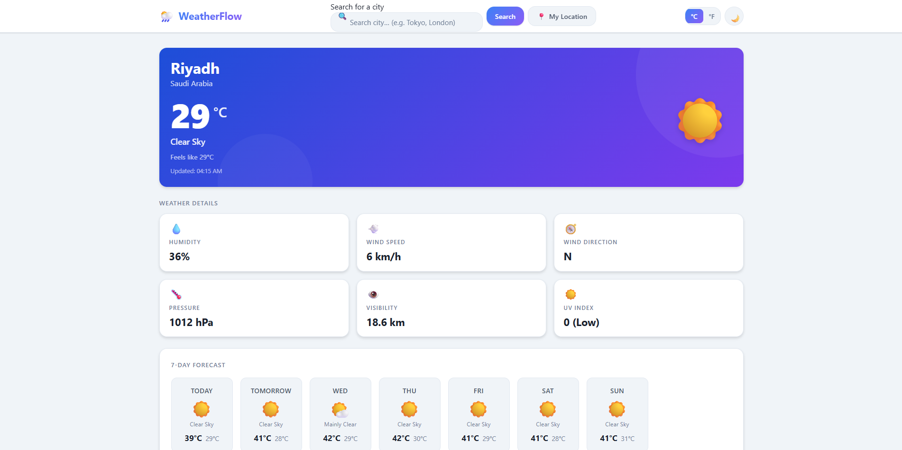
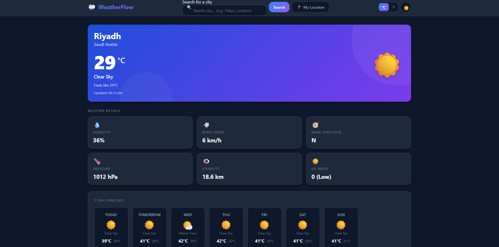

# 🌦️ WeatherFlow — Weather Dashboard

A clean, modern, and fully responsive weather dashboard built with **pure HTML5, CSS3, and Vanilla JavaScript** — no frameworks, no dependencies, and no API key required.

[🌐 **Live Demo**](https://naifdev1.github.io/Weather-Dashboard/)

---

## 📸 Preview

| Light Mode                                           | Dark Mode                                          |
| ---------------------------------------------------- | -------------------------------------------------- |
|  |  |

---

## ✨ Features

* 🔍 **City Search** — Search for cities worldwide with instant results
* 📍 **Current Location** — Detect your location using the browser's Geolocation API
* 🌡️ **Current Weather** — Temperature, weather condition, feels-like temperature, and weather icon
* 📊 **Weather Details** — Humidity, wind speed & direction, pressure, visibility, and UV index
* 📅 **7-Day Forecast** — Daily forecast cards with high/low temperatures and conditions
* 🌅 **Today at a Glance** — Sunrise, sunset, maximum humidity, maximum wind, and precipitation chance
* 🕐 **Recent Searches** — Saves the last 5 cities using LocalStorage
* 🌙 **Dark / Light Mode** — Smooth theme switching with saved preference
* 🌡️ **°C / °F Toggle** — Dynamically switch between Celsius and Fahrenheit, with wind speed (km/h ↔ mph) and pressure (hPa ↔ inHg) converting alongside it
* ❌ **Error Handling** — User-friendly messages for different failure scenarios
* ⏳ **Loading State** — Loading indicator with disabled controls while fetching data
* ♿ **Accessible** — Semantic HTML, ARIA labels, keyboard navigation, and visible focus states
* 📱 **Fully Responsive** — Optimized for mobile, tablet, and desktop screens

---

## 🛠️ Technologies

| Technology                   | Purpose                                                     |
| ---------------------------- | ----------------------------------------------------------- |
| HTML5                        | Semantic structure and accessibility                        |
| CSS3                         | Variables, Grid, Flexbox, animations, and responsive design |
| Vanilla JavaScript (ES2020+) | Application logic, API integration, and state management    |
| Fetch API                    | HTTP requests to weather and geocoding APIs                 |
| LocalStorage                 | Persisting theme, temperature unit, and recent searches     |
| Geolocation API              | Browser-based location detection                            |
| Open-Meteo API               | Free weather data without an API key                        |
| Open-Meteo Geocoding API     | City search and coordinates                                 |
| Nominatim / OpenStreetMap    | Reverse geocoding for location names                        |

---

## 🚀 Getting Started

### Option 1 — Open Directly

This project requires no build tools or package installation. Simply clone the repository and open `index.html` in your browser.

```bash
# Clone the repository
git clone https://github.com/NAIFDev1/Weather-Dashboard.git

# Navigate to the project
cd Weather-Dashboard

# Windows
start index.html

# macOS
open index.html

# Linux
xdg-open index.html
```

### Option 2 — Live Server

For development, you can use the **Live Server** extension in VS Code.

1. Install the Live Server extension.
2. Open the project in VS Code.
3. Right-click `index.html`.
4. Select **Open with Live Server**.

### Option 3 — Python HTTP Server

```bash
cd Weather-Dashboard
python3 -m http.server 8080
```

Then open:

```text
http://localhost:8080
```

---

## 📡 API Information

### Weather Data — Open-Meteo

* **API:** Open-Meteo Forecast API
* **Requires API Key:** ❌ No
* **Coverage:** 🌍 Worldwide
* **Data:** Current weather, daily forecasts, UV index, visibility, pressure, wind, humidity, and more

### City Search — Open-Meteo Geocoding

* **API:** Open-Meteo Geocoding API
* **Requires API Key:** ❌ No
* **Purpose:** Converts city names into geographic coordinates

### Reverse Geocoding — Nominatim / OpenStreetMap

* **API:** Nominatim Reverse Geocoding
* **Requires API Key:** ❌ No
* **Purpose:** Converts GPS coordinates into readable location information
* **Usage:** Used when the user selects **My Location**

> Nominatim has usage requirements and rate limits. Production applications should follow the official OpenStreetMap Nominatim usage policy.

---

## 📁 Project Structure

```text
Weather-Dashboard/
│
├── screenshots/
│   ├── light-mode.png
│   └── dark-mode.png
│
├── index.html       # Application structure
├── style.css        # Styling, layout, themes, and responsive design
├── script.js        # API calls, DOM manipulation, and application logic
└── README.md        # Project documentation
```

---

## 🧩 JavaScript Architecture

The application is organized into focused and reusable functions:

| Function                                | Purpose                                              |
| --------------------------------------- | ---------------------------------------------------- |
| `fetchWeather(lat, lon, city, country)` | Fetches weather data from Open-Meteo                 |
| `searchCity(query)`                     | Searches for a city and retrieves its weather        |
| `getCurrentLocation()`                  | Uses the Geolocation API and reverse geocoding       |
| `displayWeather(data, city, country)`   | Renders the current weather information              |
| `displayForecast(data)`                 | Renders the 7-day forecast                           |
| `displayExtra(data)`                    | Renders today's additional weather statistics        |
| `toggleTemperatureUnit(unit)`           | Switches between °C and °F                           |
| `toggleTheme()`                         | Switches between light and dark mode                 |
| `saveRecentSearch(city)`                | Saves a city to LocalStorage                         |
| `loadRecentSearches()`                  | Loads saved recent searches                          |
| `renderRecentSearches(recent)`          | Renders recent search buttons                        |
| `showLoading()` / `hideLoading()`       | Controls the loading state                           |
| `showMessage(text, type)`               | Displays information and error messages              |
| `init()`                                | Initializes the application and restores preferences |

---

## 🌈 Customization

The main design tokens and colors are defined in `style.css` using CSS variables.

```css
:root {
  --accent-gradient-start: #3b82f6;
  --accent-gradient-end: #8b5cf6;
  --radius-lg: 16px;
  /* Additional design variables */
}
```

These variables make it easy to customize the application's visual style without modifying individual components.

---

## 🩹 Recent Fixes

* Cancels stale in-flight requests, so rapidly switching between a search and "My Location" no longer risks the older response overwriting the newer one.
* Wind speed and pressure now convert with the °C/°F toggle instead of staying locked to km/h and hPa.
* Fixed `aria-pressed` on the unit toggle not updating for screen readers.
* Removed the dark-mode flash on load for users with a dark system preference.
* Recent searches now store coordinates, so re-selecting one goes straight to the right place instead of re-searching by name (which could resolve to the wrong city for common names).

## 🔮 Future Improvements

* [ ] Hourly forecast chart using Canvas API
* [ ] Weather map integration
* [ ] Air quality index section
* [ ] Animated weather backgrounds based on weather conditions
* [ ] Progressive Web App (PWA) support
* [ ] Share weather cards as images
* [ ] Multi-city comparison
* [ ] Weather alerts and severe weather warnings

---

## 📜 License

This project is open source and available under the [MIT License](LICENSE).

---

## 🙏 Credits

* Weather data: [Open-Meteo](https://open-meteo.com/)
* Geocoding: [Open-Meteo Geocoding API](https://open-meteo.com/en/docs/geocoding-api)
* Reverse geocoding: [Nominatim / OpenStreetMap](https://nominatim.openstreetmap.org/)
* Weather icons: Native emoji — no external dependency

---

> Built as a portfolio project demonstrating clean HTML/CSS/JavaScript development, API integration, responsive design, browser APIs, local storage, and accessibility best practices.
