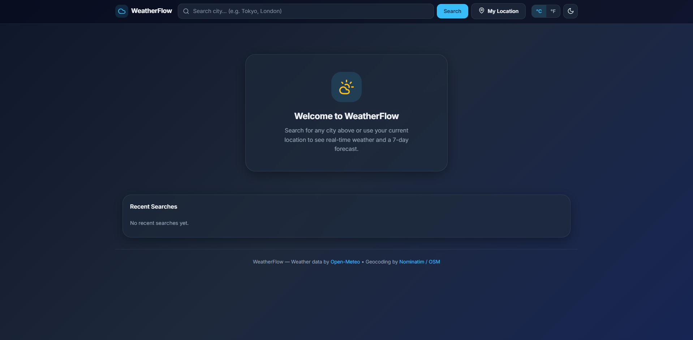
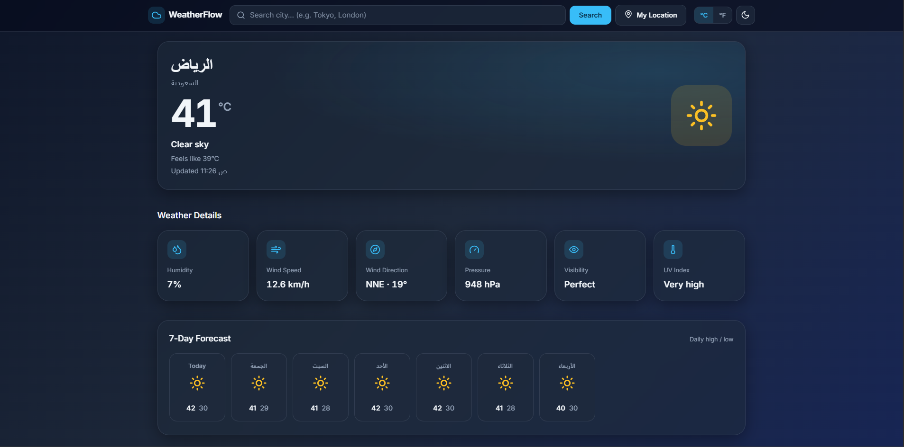

# 🌦️ WeatherFlow — Weather Dashboard

A clean, modern, and fully responsive weather dashboard built with **pure HTML5, CSS3, and Vanilla JavaScript** — no frameworks, no build tools, no dependencies, and no API key required.

[🌐 **Live Demo**](https://naifdev1.github.io/Weather-Dashboard/)

---

## 📸 Preview

| Landing & Search Interface                           | Current Weather Interface                           |
| :--------------------------------------------------- | :-------------------------------------------------- |
|  |  |

---

## ✨ Features

* 🔍 **City Search** — Instant worldwide city search powered by Nominatim
* 📍 **My Location** — Detect your location with the browser's Geolocation API
* 🌡️ **Current Weather** — Temperature, condition, feels-like, and SVG weather icon
* 📊 **Weather Details** — Humidity, wind speed & direction, pressure, visibility, and UV index
* 📅 **7-Day Forecast** — Daily cards with high/low temperatures and conditions
* 🌅 **Today at a Glance** — Sunrise, sunset, max humidity, max wind, and precipitation chance
* 🕐 **Recent Searches** — Stores the last **8** cities (with coordinates) in LocalStorage, restorable with one click
* ♻️ **Last City Restored** — Reopens your last viewed city automatically on reload
* 🌙 **Dark / Light Mode** — Smooth theme switching with saved preference and no flash on load
* 🌡️ **°C / °F Toggle** — Converts temperature, wind speed (km/h ↔ mph), and pressure (hPa ↔ inHg) together
* ⏳ **Loading State** — Spinner with disabled controls while fetching
* ❌ **Error Handling** — Clear messages for network, geocoding, and permission failures
* 🛑 **Request Cancellation** — Stale in-flight requests are aborted so results never override newer ones
* ⌨️ **Keyboard Shortcut** — Press `/` to focus the search box from anywhere
* ♿ **Accessible** — Semantic HTML, ARIA labels, `aria-pressed` states, keyboard navigation, and visible focus
* 📱 **Fully Responsive** — Optimized for mobile, tablet, and desktop

---

## 🛠️ Technologies

| Technology                   | Purpose                                                     |
| ---------------------------- | ------------------------------------------------------------ |
| HTML5                        | Semantic structure and accessibility                         |
| CSS3                         | Variables, Grid, Flexbox, animations, and responsive design |
| Vanilla JavaScript (ES2020+) | Application logic, API integration, and state management    |
| Fetch API + AbortController  | HTTP requests with stale-request cancellation               |
| LocalStorage                 | Theme, unit preference, recent searches, and last city      |
| Geolocation API              | Browser-based location detection                            |
| Open-Meteo API               | Free weather data without an API key                        |
| Nominatim / OpenStreetMap    | City search and reverse geocoding                           |

---

## 🚀 Getting Started

### Option 1 — Open Directly

No build tools or installation required. Clone the repository and open `index.html`.

```bash
# Clone the repository
git clone https://github.com/NAIFDev1/Weather-Dashboard.git

# Navigate to the project
cd Weather-Dashboard

# Windows
start index.html

# macOS
open index.html

# Linux
xdg-open index.html
```

### Option 2 — Live Server

For development, use the **Live Server** extension in VS Code:

1. Install the Live Server extension.
2. Open the project in VS Code.
3. Right-click `index.html`.
4. Select **Open with Live Server**.

### Option 3 — Python HTTP Server

```bash
cd Weather-Dashboard
python3 -m http.server 8080
```

Then open:

```text
http://localhost:8080
```

---

## 📡 API Information

All APIs are free and require **no API key**.

### Weather Data — Open-Meteo

* **API:** Open-Meteo Forecast API
* **Requires API Key:** ❌ No
* **Coverage:** 🌍 Worldwide
* **Data:** Current weather, 7-day forecast, UV index, visibility, pressure, wind, humidity, and more

### City Search — Nominatim / OpenStreetMap

* **API:** Nominatim Search API
* **Requires API Key:** ❌ No
* **Purpose:** Converts city names into geographic coordinates

### Reverse Geocoding — Nominatim / OpenStreetMap

* **API:** Nominatim Reverse Geocoding
* **Requires API Key:** ❌ No
* **Purpose:** Converts GPS coordinates into a readable location name
* **Usage:** Used when the user selects **My Location**

> Matters to check Nominatim's usage policy and rate limits for production applications.

---

## 📁 Project Structure

```text
Weather-Dashboard/
│
├── screenshots/
│   ├── light-mode.png
│   └── dark-mode.png
│
├── index.html   # Application structure
├── style.css    # Styling, layout, themes, and responsive design
├── script.js    # API calls, DOM manipulation, and application logic
└── README.md    # Project documentation
```

---

## 🧩 JavaScript Architecture

The application is organized into focused, reusable functions:

| Function                              | Purpose                                                    |
| ------------------------------------- | ---------------------------------------------------------- |
| `geocodeCity(query)`                  | Searches for a city via Nominatim                          |
| `reverseGeocode(lat, lon)`            | Resolves coordinates to a place name via Nominatim         |
| `fetchWeather(lat, lon)`              | Fetches weather data from Open-Meteo                       |
| `runWeatherSearch(city)`              | Fetches weather for a city and renders the dashboard       |
| `handleSearch(query)`                 | Entry point for the city search flow                       |
| `handleMyLocation()`                  | Uses the Geolocation API and reverse geocoding             |
| `renderDashboard()`                   | Renders current weather and detail cards                   |
| `renderForecast()`                    | Renders the 7-day forecast                                 |
| `renderForecastIcon(date)`            | Renders the SVG icon for a forecast day                    |
| `toDisplayTemp() / toDisplayWind()`   | Converts °C↔°F and km/h↔mph                                |
| `formatPressure() / formatVisibility()`| Formats pressure and visibility with the active units     |
| `degToCompass(deg)`                   | Converts wind degrees to a compass direction               |
| `uvCategory(index)`                   | Maps the UV index to a readable label                      |
| `updateUnitUI()`                      | Syncs the °C/°F toggle buttons and `aria-pressed` states   |
| `getRecent() / addRecent() / renderRecent()` | Reads, saves, and renders the last 8 recent searches |
| `clearRecent()`                       | Clears all recent searches                                 |
| `applyTheme(theme) / toggleTheme()`   | Switches between light and dark mode                       |
| `showLoading() / hideLoading()`       | Controls the loading state                                 |
| `showMessage(text, type)`             | Displays information and error messages                    |
| `bindEvents()`                        | Wires up all event listeners                               |
| `init()`                              | Initializes the app and restores preferences and last city |

### LocalStorage Keys

| Key                    | Purpose                                      |
| ---------------------- | --------------------------------------------- |
| `weatherflow_theme`    | Persists the dark/light theme preference      |
| `weatherflow_recent`   | Stores the last 8 recent searches with coords |
| `weatherflow_last_city`| Restores the last viewed city on reload       |

---

## 🌈 Customization

Design tokens are defined as CSS variables in `style.css` under `:root` (light) and `[data-theme="dark"]` (dark).

```css
:root {
  --bg-gradient-1: #eef6ff;
  --bg-gradient-2: #dbeafe;
  --background: rgba(255, 255, 255, 0.55);
  --foreground: #0f172a;
  --primary: #0284c7;
  --accent: #d97706;
  --card: rgba(255, 255, 255, 0.55);
  --card-strong: rgba(255, 255, 255, 0.72);
  --border: rgba(2, 132, 199, 0.14);
}

[data-theme="dark"] {
  --bg-gradient-2: #1e293b;
  --card: rgba(30, 41, 59, 0.55);
  --card-strong: rgba(30, 41, 59, 0.72);
  --primary: #38bdf8;
  --accent: #fbbf24;
  --border: rgba(148, 163, 184, 0.16);
}
```

Change any variable to restyle the entire application without touching individual components.

---

## 🩹 Recent Fixes

* Cancels stale in-flight requests, so rapidly switching between a search and "My Location" no longer lets an older response overwrite a newer one.
* Wind speed and pressure now convert together with the °C/°F toggle instead of staying locked to km/h and hPa.
* Fixed `aria-pressed` on the unit toggle not updating for screen readers.
* Removed the dark-mode flash on load for users with a dark system preference.
* Recent searches now store coordinates, so re-selecting one goes straight to the right location instead of re-searching by name (which could resolve to the wrong city for common names).
* The last viewed city is restored on reload for a smoother return to the app.

---

## 🔮 Future Improvements

* [ ] Hourly forecast chart using Canvas API
* [ ] Weather map integration
* [ ] Air quality index section
* [ ] Animated weather backgrounds based on conditions
* [ ] Progressive Web App (PWA) support
* [ ] Share weather cards as images
* [ ] Multi-city comparison
* [ ] Weather alerts and severe weather warnings

---

## 🙏 Credits

* Weather data: [Open-Meteo](https://open-meteo.com/)
* Geocoding: [Nominatim / OpenStreetMap](https://nominatim.openstreetmap.org/)
* Reverse geocoding: [Nominatim / OpenStreetMap](https://nominatim.openstreetmap.org/)
* Weather icons: Inline SVG icon sprite — no external dependency

---

> Built as a portfolio project demonstrating clean HTML/CSS/JavaScript development, API integration, responsive design, browser APIs, local storage, and accessibility best practices.
